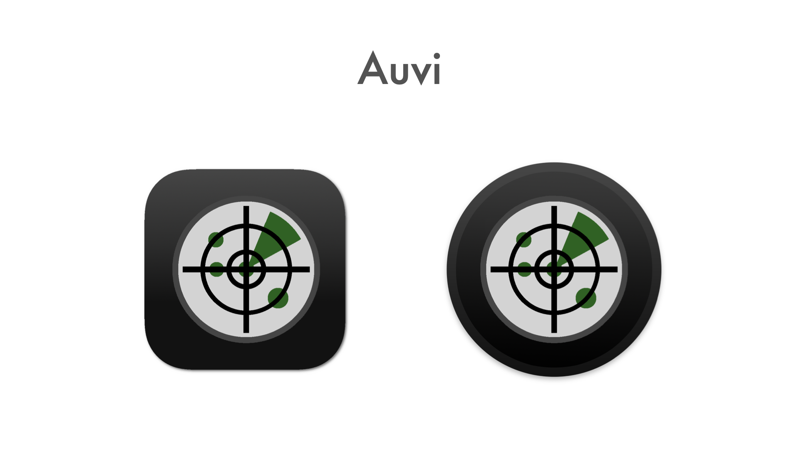
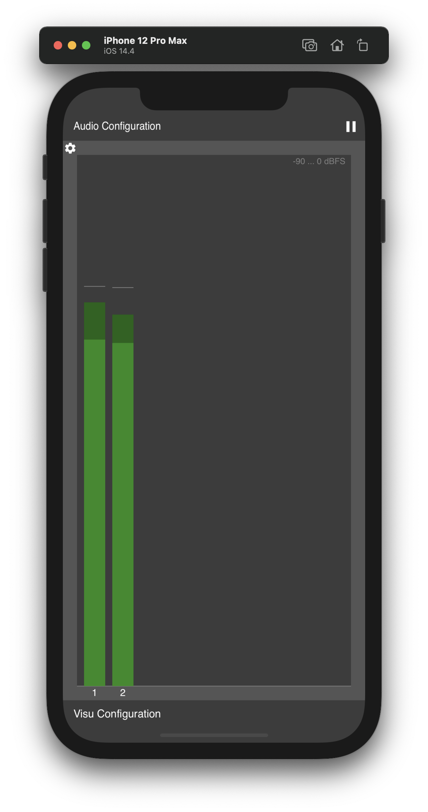
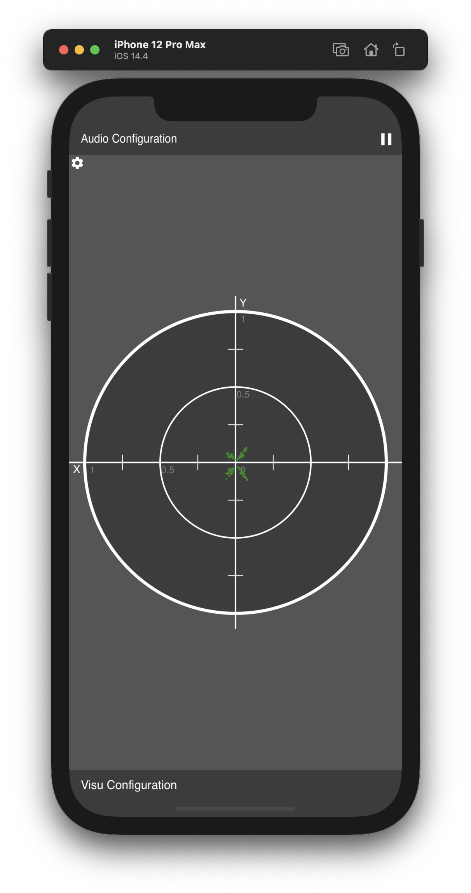
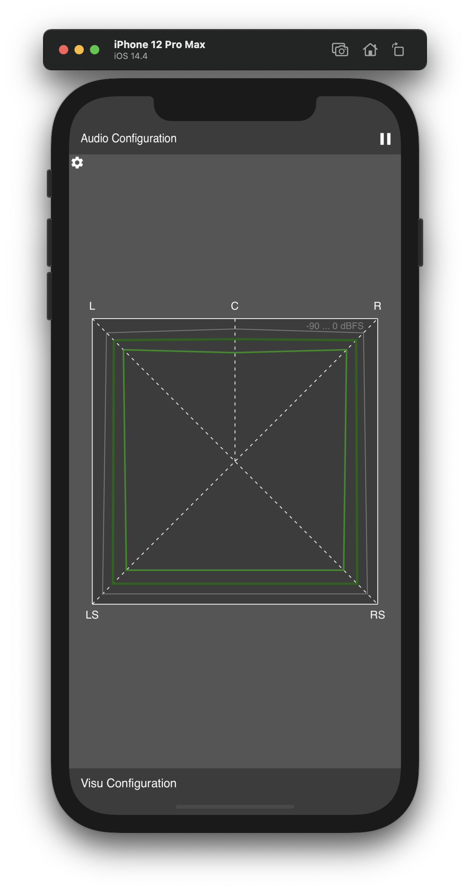
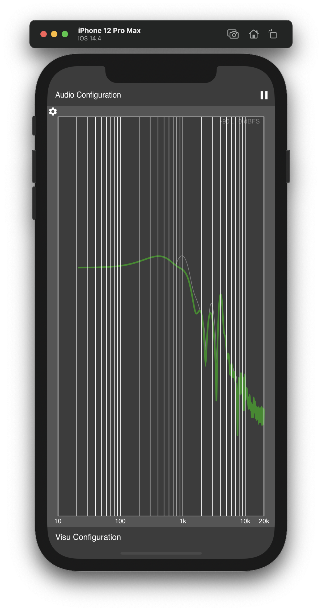
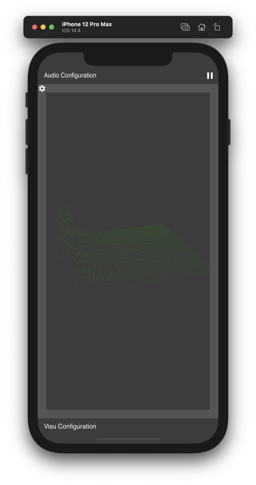
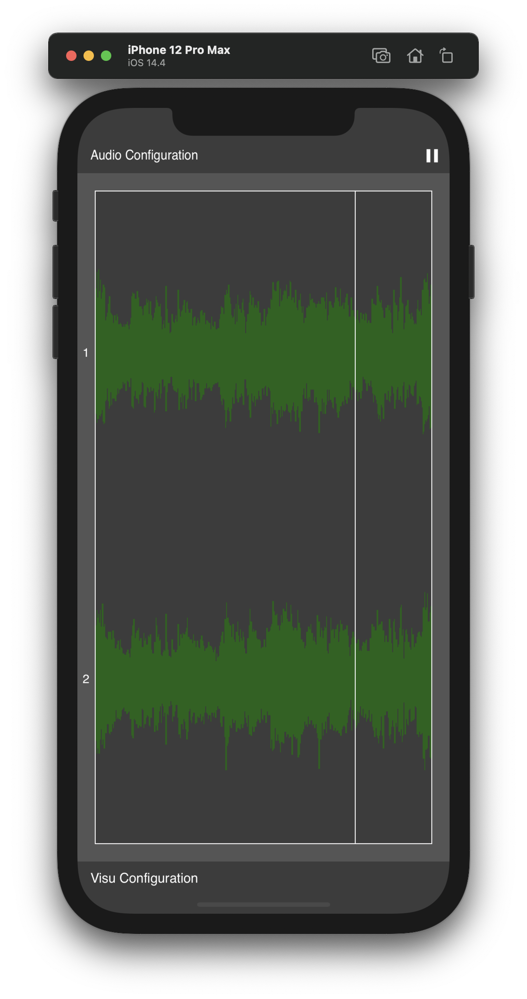

Auvi is a programming experiment to try out several audio visualization ideas using JUCE framework.

Its sourcecode and prebuilt binaries are made publicly available to enable interested users to experiment, extend and create own adaptations.

Use what is provided here at your own risk!

<table>
  <tr>
    <td colspan="3">Implemented visualizers (all WIP - in unfinished and unreliable state)</td>
  </tr>
  <tr>
    <td>MultiMeter</td>
    <td></td>
    <td>Peak/RMS level meter with configurable dbFS/Linear scale</td>
  </tr>
  <tr>
	<td>XY Scope</td>
    <td></td>
    <td>XY Scope view with configurable dbFS/Linear scale</td>
  </tr>
  <tr>
	<td>SSA</td>
    <td></td>
    <td>SurroundSoundAnalyzer with configurable dbFS/Linear scale</td>
  </tr>
  <tr>
	<td>RTA</td>
    <td></td>
    <td>RealTimeAnalyzer</td>
  </tr>
  <tr>
	<td>Waterfall </td>
    <td></td>
    <td>3D freq./time waterfall</td>
  </tr>
  <tr>
	<td>Waveform</td>
    <td></td>
    <td>Peak waveform plot</td>
  </tr>
</table>